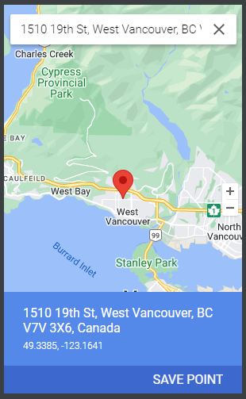

# W23_G3_CoachMe

## CSIS 3175 Term Project
 

### **The Team**
 

| Name               | Student ID |
|--------------------|------------|
| Andrea Blanco      | 300352964  |
| Luis Miranda       | 300363056  |
| Jaydipkumar Mulani | 300353056  |

 

### **The App**

*Coach Me* is a fitness app that aims to help people achieve their health and fitness goals through personalized training. Users can book appointments with nearby trainers using geolocation technology or access a library of self-workout plans tailored to their specific objectives. 

The app is designed to make it convenient for users to reach their fitness goals, whether they prefer to work out with a trainer or on their own.
 

### **CONTRIBUTION'S REPORT**

To review the contribution's report, please click on the following link:
[Contribution's Report Link](https://collegedouglas.sharepoint.com/:x:/s/3175_FinalProject/ERSkxYFRu79Oj33VS1RPd-MBDqUkiF_rA4XIvLLIGqQFaQ?email=kandhadaip%40douglascollege.ca&e=Cymi9U)

### To test the app
 
We recommend to set the location of your emulator as per the following image 
 
